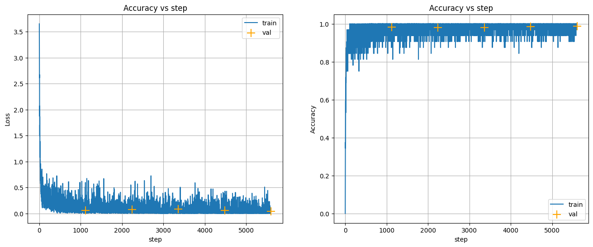

# Классификация изображений с помощью EfficientNet-B0

## Краткое описание
- В этом ноутбуке для задачи классификации изображений используется предобученная модель **EfficientNet-B0**.
- Модель дообучается на датасете из 32 классов фруктов и овощей.
- Последний слой `classifier` заменяется на новый, соответствующий количеству классов в задаче.
- Обучение проводится в течение 10 эпох с использованием оптимизатора Adam и планировщика `MultiStepLR`.

## Содержание
- [Шаг 1: Установка и импорт библиотек](#шаг-1-установка-и-импорт-библиотек)
- [Шаг 2: Подготовка данных](#шаг-2-подготовка-данных)
- [Шаг 3: Определение модели](#шаг-3-определение-модели)
- [Шаг 4: Обучение модели](#шаг-4-обучение-модели)
- [Шаг 5: Оценка результатов](#шаг-5-оценка-результатов)
- [Ключевые результаты](#ключевые-результаты)

### Шаг 1: Установка и импорт библиотек {#шаг-1-установка-и-импорт-библиотек}
*Цель шага*: Импорт необходимых библиотек для работы с данными и моделью.

```python
import torch
import torchvision
from torch import nn, optim
from torchvision import transforms
from torch.optim.lr_scheduler import MultiStepLR
import matplotlib.pyplot as plt
# и другие вспомогательные библиотеки
```

### Шаг 2: Подготовка данных {#шаг-2-подготовка-данных}
*Цель шага*: Загрузка, трансформация и создание загрузчиков данных (`DataLoader`).

**Подробности**:
- Изображения приводятся к размеру 224x224 пикселя.
- Применяется стандартная нормализация для моделей, предобученных на ImageNet.

```python
transform = transforms.Compose(
    [
        transforms.Resize((224, 224)),
        transforms.ToTensor(),
        transforms.Normalize(mean=[0.485, 0.456, 0.406], std=[0.229, 0.224, 0.225]),
    ]
)

# Загрузка данных из папок
train_data = torchvision.datasets.ImageFolder(root=TRAIN_DIR, transform=transform)
test_data = torchvision.datasets.ImageFolder(root=TEST_DIR, transform=transform)

# Создание DataLoader'ов
train_loader = torch.utils.data.DataLoader(train_data, batch_size=32, shuffle=True)
test_loader = torch.utils.data.DataLoader(test_data, batch_size=32, shuffle=False)
```

### Шаг 3: Определение модели {#шаг-3-определение-модели}
*Цель шага*: Загрузка предобученной модели `EfficientNet-B0` и адаптация ее под нашу задачу.

**Подробности**:
- Загружается модель `efficientnet_b0` с весами, полученными на ImageNet.
- Последний полносвязный слой (`classifier`) заменяется на новый `nn.Linear` с 32 выходными нейронами (по числу классов).

```python
model = torchvision.models.efficientnet_b0(weights="IMAGENET1K_V1")

# Замена последнего слоя
num_features = model.classifier[1].in_features
model.classifier[1] = nn.Linear(num_features, 32)

model = model.to(device)
```

### Шаг 4: Обучение модели {#шаг-4-обучение-модели}
*Цель шага*: Определение функции потерь, оптимизатора и запуск цикла обучения.

**Подробности**:
- В качестве функции потерь используется `CrossEntropyLoss`.
- Оптимизатор — `Adam` с начальной скоростью обучения `1e-3`.
- `MultiStepLR` используется для снижения скорости обучения на 5-й и 8-й эпохах.

```python
criterion = nn.CrossEntropyLoss()
optimizer = optim.Adam(model.parameters(), lr=1e-3)
scheduler = MultiStepLR(optimizer, milestones=[5, 8], gamma=0.1)

# Цикл обучения на 10 эпох
# ... (код функции train)
train(model, criterion, optimizer, train_loader, test_loader, scheduler, epochs=10)
```

### Шаг 5: Оценка результатов {#шаг-5-оценка-результатов}
*Цель шага*: Визуализация истории обучения для анализа производительности модели.

```python
# Функция для отрисовки графиков
def plot_history(train_loss_log, val_loss_log, train_acc_log, val_acc_log):
    # ... (код для построения графиков)

plot_history(train_loss_log, val_loss_log, train_acc_log, val_acc_log)
```

## Ключевые результаты {#ключевые-результаты}

### Графики обучения


### Интерпретация
- **Точность**: Модель достигает высокой точности на валидационном наборе данных (около **98%**), что свидетельствует об отличной обобщающей способности.
- **Потери (Loss)**: Значения потерь стабильно снижаются как на обучающей, так и на валидационной выборке, что указывает на успешное обучение без значительного переобучения.
- **Эффективность**: `EfficientNet-B0` демонстрирует, что даже легковесные современные архитектуры способны достигать высокой производительности при правильном дообучении (fine-tuning).
