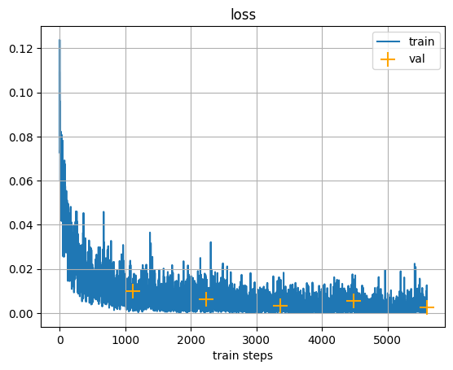

---
hide:
  - navigation
---

# Классификация изображений с помощью ResNet50

## Краткое описание
- В данном ноутбуке для задачи классификации изображений используется предобученная модель **ResNet50**.
- Модель дообучается на датасете из 32 классов фруктов и овощей.
- Последний полносвязный слой (`fc`) заменяется на новый, соответствующий количеству классов в задаче.
- Обучение проводится в течение 10 эпох с использованием оптимизатора Adam.

## Содержание
- [Шаг 1: Установка и импорт библиотек](#шаг-1-установка-и-импорт-библиотек)
- [Шаг 2: Подготовка данных](#шаг-2-подготовка-данных)
- [Шаг 3: Определение модели](#шаг-3-определение-модели)
- [Шаг 4: Обучение модели](#шаг-4-обучение-модели)
- [Шаг 5: Оценка результатов](#шаг-5-оценка-результатов)
- [Ключевые результаты](#ключевые-результаты)

### Шаг 1: Установка и импорт библиотек {#шаг-1-установка-и-импорт-библиотек}
*Цель шага*: Импорт необходимых библиотек для работы с данными и моделью.

```python
import torch
import torchvision
from torch import nn, optim
from torchvision import transforms
import matplotlib.pyplot as plt
# и другие вспомогательные библиотеки
```

### Шаг 2: Подготовка данных {#шаг-2-подготовка-данных}
*Цель шага*: Загрузка, трансформация и создание загрузчиков данных (`DataLoader`).

```python
transform = transforms.Compose(
    [
        transforms.Resize((224, 224)),
        transforms.ToTensor(),
        transforms.Normalize(mean=[0.485, 0.456, 0.406], std=[0.229, 0.224, 0.225]),
    ]
)

# Загрузка данных из папок
train_data = torchvision.datasets.ImageFolder(root=TRAIN_DIR, transform=transform)
test_data = torchvision.datasets.ImageFolder(root=TEST_DIR, transform=transform)

# Создание DataLoader'ов
train_loader = torch.utils.data.DataLoader(train_data, batch_size=32, shuffle=True)
test_loader = torch.utils.data.DataLoader(test_data, batch_size=32, shuffle=False)
```

### Шаг 3: Определение модели {#шаг-3-определение-модели}
*Цель шага*: Загрузка предобученной модели `ResNet50` и адаптация ее под нашу задачу.

```python
model = torchvision.models.resnet50(weights="IMAGENET1K_V1")

# Замена последнего слоя
num_features = model.fc.in_features
model.fc = nn.Linear(num_features, 32)

model = model.to(device)
```

### Шаг 4: Обучение модели {#шаг-4-обучение-модели}
*Цель шага*: Определение функции потерь, оптимизатора и запуск цикла обучения.

```python
criterion = nn.CrossEntropyLoss()
optimizer = optim.Adam(model.parameters(), lr=0.001)

# Цикл обучения на 10 эпох
# ... (код функции train)
train(model, criterion, optimizer, train_loader, test_loader, epochs=10)
```

### Шаг 5: Оценка результатов {#шаг-5-оценка-результатов}
*Цель шага*: Визуализация истории обучения для анализа производительности модели.

```python
# Функция для отрисовки графиков
def plot_history(train_history, val_history, title="loss"):
    # ... (код для построения графиков)

plot_history(train_loss_history, val_loss_history, title='loss')
plot_history(train_acc_history, val_acc_history, title='accuracy')
```

## Ключевые результаты {#ключевые-результаты}

### Графики обучения


### Интерпретация
- **Точность**: Модель `ResNet50` показывает очень высокую производительность, достигая точности на валидационном наборе около **99%**.
- **Потери (Loss)**: Графики потерь демонстрируют уверенное снижение, что говорит об эффективном обучении.
- **Сравнение**: `ResNet50` показывает себя немного лучше, чем `EfficientNet-B0` на данной задаче, хотя обе модели достигают отличных результатов. Это подтверждает, что классические архитектуры глубокого обучения остаются чрезвычайно мощным инструментом для классификации изображений.
