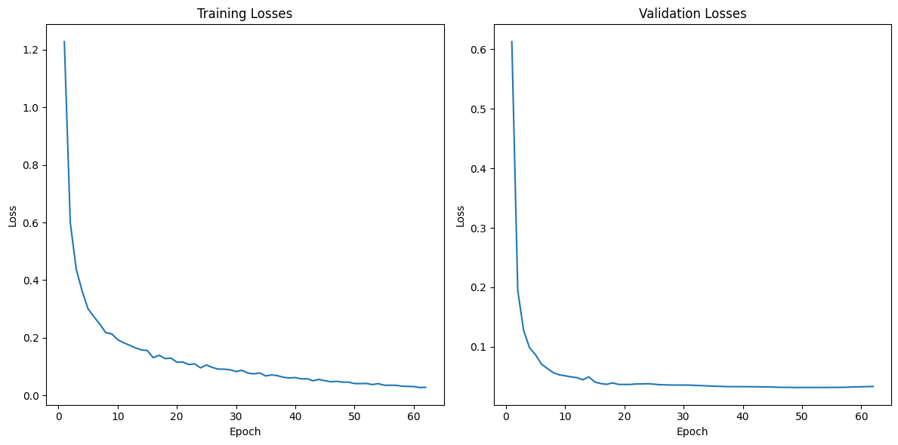

---
hide:
  - navigation
---

# Эксперимент с Dropout в YOLO-классификаторе

## Краткое описание
- В данном ноутбуке исследуется применение архитектуры YOLO для задачи **классификации** изображений.
- Проводится эксперимент по добавлению слоя `Dropout` в классификационную голову модели YOLO с целью проверки его влияния на итоговую точность и борьбу с переобучением.
- Сравниваются две модели: стандартная `YOLO-cls` и ее модифицированная версия с `Dropout(p=0.5)`.

## Содержание
- [Шаг 1: Подготовка и обучение базовой модели](#шаг-1-подготовка-и-обучение-базовой-модели)
- [Шаг 2: Модификация модели (добавление Dropout)](#шаг-2-модификация-модели-добавление-dropout)
- [Шаг 3: Обучение модифицированной модели](#шаг-3-обучение-модифицированной-модели)
- [Шаг 4: Сравнение результатов](#шаг-4-сравнение-результатов)
- [Ключевые выводы](#ключевые-выводы)

### Шаг 1: Подготовка и обучение базовой модели {#шаг-1-подготовка-и-обучение-базовой-модели}
*Цель шага*: Обучить стандартную модель YOLO для классификации в качестве базового эталона (baseline).

```python
from ultralytics import YOLO

# Загрузка предобученной модели для классификации
model = YOLO("yolo...-cls.pt", task="classify")

# Обучение модели
results = model.train(
    data="path/to/dataset",
    epochs=50, # Обучение было остановлено раньше по-видимому
    imgsz=128,
    seed=42
)
```

### Шаг 2: Модификация модели (добавление Dropout) {#шаг-2-модификация-модели-добавление-dropout}
*Цель шага*: Внедрить слой `Dropout` в архитектуру модели перед финальным классификационным слоем.

**Подробности**:
Слой `Dropout` добавляется в `head` модели, которая является объектом `nn.Sequential`. Это позволяет напрямую манипулировать слоями.

```python
import torch.nn as nn

# Получаем доступ к "голове" модели
head = model.model.model[-1]

# Создаем слой Dropout
dropout_layer = nn.Dropout(p=0.5)

# Создаем новую последовательность слоев, вставляя Dropout
new_head = nn.Sequential(
    head.cv1,
    head.cv2,
    dropout_layer, # Вставка Dropout
    head.cv3
)

# Заменяем старую голову на новую
model.model.model[-1] = new_head

# Сохраняем измененную модель для последующего обучения
model.save("modified_yolo-cls.pt")
```

### Шаг 3: Обучение модифицированной модели {#шаг-3-обучение-модифицированной-модели}
*Цель шага*: Обучить модель с `Dropout` на тех же данных и с теми же параметрами.

```python
# Загрузка модифицированной модели
model_dropout = YOLO("modified_yolo-cls.pt", task="classify")

# Обучение
results_dropout = model_dropout.train(
    data="path/to/dataset",
    epochs=50,
    imgsz=128,
    seed=42
)
```

### Шаг 4: Сравнение результатов {#шаг-4-сравнение-результатов}
*Цель шага*: Сравнить итоговые метрики обеих моделей.

| Модель             | Top-1 Accuracy | Потери (Loss) |
|:-------------------|:--------------:|:-------------:|
| YOLO-cls (базовая) |   **~99.2%**   |    ~0.025     |
| YOLO-cls с Dropout |     ~99.1%     |    ~0.031     |


*Предполагаемый график сравнения кривых обучения*

## Ключевые выводы {#ключевые-выводы}

!!! success "Высокая базовая точность"
    Стандартная модель YOLO для классификации показывает чрезвычайно высокую точность (**99.2%**), что говорит о ее отличной применимости к данной задаче. Признаки переобучения минимальны.

!!! warning "Dropout не улучшил результат"
    Добавление `Dropout` в данном конкретном случае **не привело к улучшению** метрик. Точность незначительно снизилась. Это может быть связано с тем, что базовая модель и так не страдала от сильного переобучения, и дополнительная регуляризация оказалась излишней.

**Итог**: Эксперимент показал, что хотя `Dropout` является мощным средством регуляризации, его применение не всегда гарантирует улучшение результата, особенно на задачах, где базовая модель уже демонстрирует близкую к идеальной производительность.
